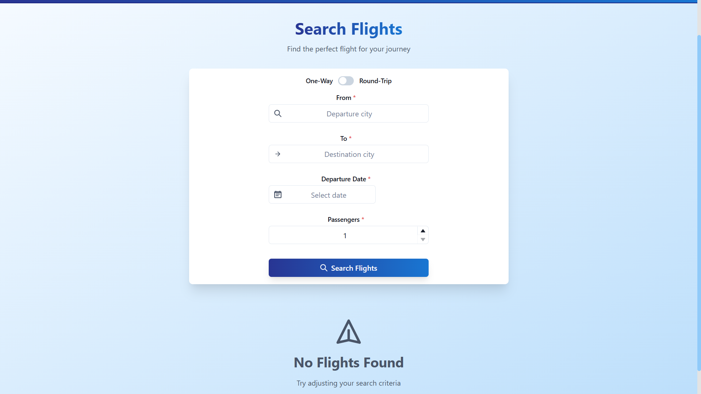
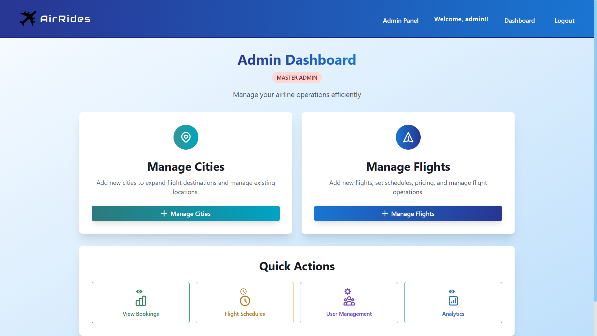
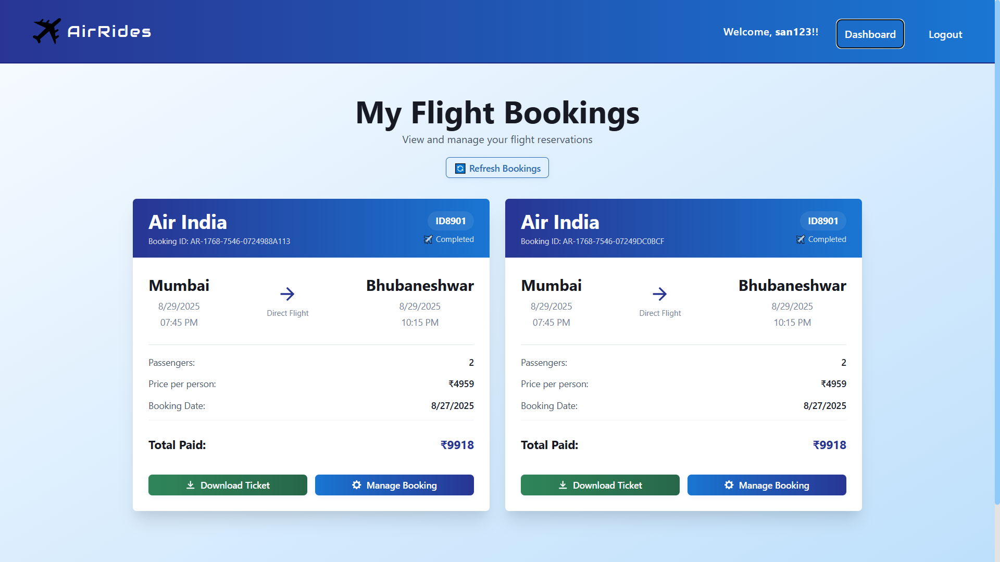

# ✈️ AirRides - Flight Booking System
[](https://reactjs.org/)
[](https://nodejs.org/)
[](https://mongodb.com/)
[](https://chakra-ui.com/)

> 📸 **[View Demo Screenshots](./demoimages)** | See the complete application interface and features

A comprehensive **MERN Stack** flight booking web application with advanced admin management, secure payments, and modern UI design.







(PLEASE REFER TO "demoimages" folder for website demo view)

## 🌟 Key Features

### Core Functionality
- **✈️ Flight Search & Booking** - Search flights by destination, date, and preferences
- **👤 User Authentication** - Secure JWT-based login/registration system
- **💳 Payment Integration** - RazorPay integration for secure transactions
- **📱 Responsive Design** - Mobile-first approach with Chakra UI components

### Advanced Admin System
- **🏢 Hierarchical Admin Access** - Master Admin (env-based) + Assigned Admin (database)
- **👥 User Management** - Complete CRUD operations for user accounts
- **🏙️ City Management** - Add/remove flight destinations
- **✈️ Flight Management** - Create, edit, and manage flight schedules
- **📊 Booking Analytics** - View and manage customer bookings


## 🛠️ Technology Stack

### Frontend
- **React** 18.0+ - Core UI framework
- **Vite** 5.0+ - Build tool and dev server
- **Chakra UI** 2.10+ - Component library & theming
- **React Router** 6.0+ - Client-side routing

### Backend
- **Node.js** 18.0+ - Runtime environment
- **Express.js** 4.19+ - Web application framework
- **MongoDB** 6.0+ - NoSQL database
- **Mongoose** 8.4+ - MongoDB ODM
- **JWT** 9.0+ - Authentication tokens
- **bcrypt** 5.1+ - Password hashing

### Payment & Security
- **RazorPay** 2.9+ - Payment gateway integration
- **CORS** 2.8+ - Cross-origin resource sharing
- **MongoDB Transactions** - ACID-compliant payment processing
- **crypto** (Node.js built-in) - HMAC signature verification

## 💎 Payment Reliability System

### 99.9% Transaction Reliability
AirRides implements enterprise-grade payment reliability with the following features:

#### 🔒 ACID Transaction Guarantees
- **MongoDB Sessions & Transactions** - All payment operations wrapped in atomic transactions
- **Rollback on Failure** - Automatic rollback if any step fails
- **Idempotency Enforcement** - Duplicate payment prevention via payment_id tracking
- **Atomic Seat Updates** - Prevents race conditions with concurrent bookings

#### 🔄 Automatic Payment Recovery
- **Orphaned Payment Detection** - Background job runs every 5 minutes
- **Automatic Retry Logic** - Max 3 retry attempts for failed payments
- **Webhook Fallback** - Razorpay webhooks for payment status updates
- **Payment Logging** - Comprehensive audit trail for all transactions

#### 📊 Real-time Monitoring
- **Success Rate Tracking** - Live calculation of payment success percentage
- **Reliability Metrics** - Uptime percentage and threshold monitoring
- **Health Alerts** - Automatic alerts when reliability drops below 99.9%
- **Payment Statistics API** - Real-time and historical payment analytics

#### 🛡️ Security Features
- **HMAC-SHA256 Verification** - Webhook signature validation
- **Payment Signature Validation** - Razorpay order_id|payment_id verification
- **Environment Secret Management** - Secure webhook secret storage

### Payment Reliability Endpoints
```javascript
GET  /api/payment-stats     // Real-time metrics and database statistics
GET  /api/payment-health    // Health status and reliability alerts
POST /api/payment-recovery/manual  // Trigger manual recovery job
POST /razorpay-webhook      // Webhook for payment status updates
```

### How It Works
1. **Payment Attempt** - User initiates payment, logged in PaymentLog collection
2. **Transaction Begin** - MongoDB session starts with ACID guarantees
3. **Idempotency Check** - Verify payment hasn't been processed already
4. **Atomic Operations** - Seat deduction + booking creation in single transaction
5. **Transaction Commit** - All-or-nothing guarantee ensures data consistency
6. **Monitoring** - Success/failure tracked in real-time metrics
7. **Recovery** - Failed payments automatically retried every 5 minutes
8. **Webhook Backup** - Razorpay webhook creates booking if frontend fails *(optional - requires deployment)*

> **⚠️ Note About Webhooks:** The Razorpay webhook is an **optional fallback mechanism**. The app works perfectly without it! Webhook setup requires either a **deployed server with public URL** or a **local tunnel tool like ngrok**. For local development, you can skip webhook configuration - all core payment features (ACID transactions, idempotency, recovery, monitoring) will function normally.


## 🚀 Installation & Setup

### Prerequisites
- Node.js 18.0 or higher
- MongoDB 6.0 or higher
- RazorPay account (for payment integration)

### 1. Clone the repository
```bash
git clone https://github.com/San4568GH/AirRides.git
cd AirRides
```

### 2. Environment Setup
Copy `.env.example` to `.env` and configure your settings:
```bash
cp .env.example .env
```

Fill in your configuration in `.env`:
```env
# Database
MONGO_URL=your_mongodb_connection_string

# Payment Gateway
RAZORPAY_KEY_ID=your_razorpay_key_id
RAZORPAY_KEY_SECRET=your_razorpay_key_secret

# Webhook Secret (OPTIONAL - only needed if deploying with webhooks)
# Leave as placeholder for local development
RAZORPAY_WEBHOOK_SECRET=temp_webhook_secret_replace_in_production

# Master Admin Credentials
ADMIN_USERNAME=admin
ADMIN_EMAIL=admin@example.com
ADMIN_PASSWORD=your_secure_password

# Server Configuration
SERVER_SECRET=your_jwt_secret_key
NODE_ENV=development
PORT=4000
```

### 3. Webhook Setup (Optional - For Production Only)

> **⚠️ Important:** Webhook configuration is **optional** and only works with a **publicly accessible URL**. The app works perfectly without webhooks for local development.

**Skip this step for local development.** When deploying to production:

1. Deploy your backend to a hosting service (Render, Railway, Heroku, etc.)
2. Get your public URL: `https://your-app.onrender.com`
3. Go to Razorpay Dashboard → Settings → Webhooks
4. Create webhook with URL: `https://your-app.onrender.com/razorpay-webhook`
5. Select events: `payment.captured`, `payment.failed`
6. Copy the generated webhook secret to your production `.env` file

**For local testing with webhooks (advanced):**
- Use a tunnel tool like [ngrok](https://ngrok.com): `ngrok http 4000`
- Use the ngrok URL in Razorpay webhook configuration

### 4. Backend Setup
```bash
cd backend
npm install
npm run dev
```

### 5. Frontend Setup
```bash
cd frontend/client
npm install
npm run dev
```

### 6. Access the Application
- **Frontend:** http://localhost:5173
- **Backend:** http://localhost:4000
- **Admin Access:** Use credentials from .env file

## 🔐 Admin Access

### Master Admin (Environment-based)
- Use credentials from `.env` file
- Full administrative privileges
- Red "Master Admin" badge

### Assigned Admin (Database-based)
- Created through setup page or user management
- Blue "Assigned Admin" badge
- Full administrative privileges

## 📁 Project Structure
```
AirRides/
├── frontend/client/     # React frontend
├── backend/            # Node.js backend
├── .env.example        # Environment template
└── README.md          # This file
```

---

**Note:** Make sure to configure your `.env` file with proper credentials before starting the application.


